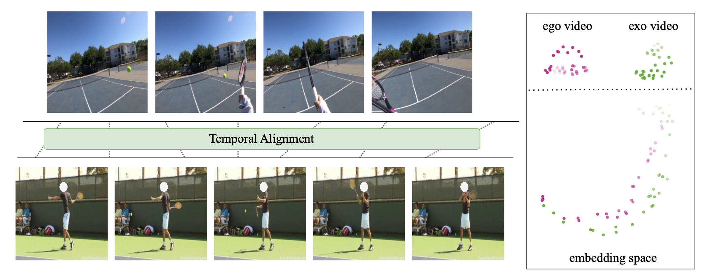
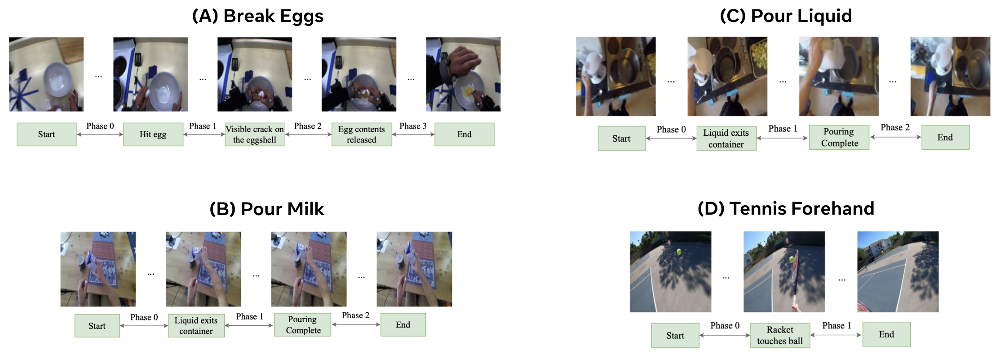

# AlignEgoExo (AE2)
[**Learning Fine-grained View-Invariant Representations from Unpaired Ego-Exo Videos via Temporal Alignment**](https://vision.cs.utexas.edu/projects/AlignEgoExo/)                                     
Zihui Xue, Kristen Grauman      
NeurIPS, 2023  
[project page](https://vision.cs.utexas.edu/projects/AlignEgoExo/) | [arxiv](https://arxiv.org/abs/2306.05526) | [bibtex](#citation)

## Overview
We present AE2, a self-supervised embedding approach to learn fine-grained action representations that are invariant to the ego-exo viewpoints.
<p align="center">
  
</p>

We propose a new [ego-exo benchmark](#ego-exo-benchmark) for fine-grained action understanding, which consist of four action-specific datasets. For evaluation, we annotate these datasets with dense per-frame labels.
<p align="center">
  
</p>

## Installation
Build a conda environment from ``environment.yml``
```
conda env create --file environment.yml
conda activate ae2
```

## Data Preparation
Download AE2 data and models [here](https://drive.google.com/drive/folders/1-v-5M5xTq8J7KDEgGQi2JhKRsQvjRaAo?usp=share_link) and save them to your designated data path.   
Modify `--dataset_root` in `utils/config.py` to be your data path.  
Note: avoid having ''ego'' in your root data path, as this could lead to potential issues.

## Ego-Exo Benchmark
We assemble ego and exo videos from five public datasets and collect a ego tennis dataset. [Our benchmark](https://drive.google.com/drive/folders/1dt34u4F2y73vDIB-Zzpx9McGSal41n1W?usp=share_link) consists of four action-specific ego-exo datasets:
+ (A) Break Eggs: ego and exo videos from [CMU-MMAC](http://kitchen.cs.cmu.edu).
+ (B) Pour Milk: ego and exo videos from [H2O](https://taeinkwon.com/projects/h2o/).
+ (C) Pour Liquid: ego pour water videos from [EPIC-Kitchens](https://epic-kitchens.github.io/2023) and exo pour videos from [HMDB51](https://serre-lab.clps.brown.edu/resource/hmdb-a-large-human-motion-database/#overview). 
+ (D) Tennis Forehand: ego videos we collect and exo tennis forehand videos from [Penn Action](http://dreamdragon.github.io/PennAction/).

Important: We divide data into train/val/test splits. 
For a fair comparison, we recommend utilizing the validation splits for selecting the best model, and evaluating final model performance on the test data only once. This helps reduce the risk of model overfitting.

## Evaluation
Evaluation of the learned representations on four downstream tasks:
+ (1) Action phase classification (regular, ego2exo and exo2ego)
+ (2) Frame retrieval (regular, ego2exo and exo2ego)
+ (3) Action phase progression
+ (4) Kendall's tau

We provide pretrained AE2 checkpoints and embeddings on test data [here](https://drive.google.com/drive/folders/1mhbro5wjlNYURs7sv2DXpSl5lBkaRsFr?usp=sharing), modify `ckpt_dir` in `scripts/eval.sh` or `scripts/eval_extract_embed.sh` to be your data path.
```shell
# We provide pre-extracted AE2 embeddings (AE2_ckpts/dataset_name_eval) for evaluation
bash scripts/eval.sh

# Additionally, you can use provided AE2 models (AE2_ckpts/dataset_name.ckpt) to extract embeddings for evaluation
bash scripts/eval_extract_embed.sh
```

## Training
We provide training scripts for AE2 on four datasets. Be sure to modify `--dataset_root` in `utils/config.py` to be your data path.
Training logs and checkpoints will be saved to `./logs/exp_{dataset_name}/{args.output_dir}`.

```shell
bash scripts/run.sh dataset_name  # choose among {break_eggs, pour_milk, pour_liquid, tennis_forehand}
```
Note: 
+ <span style="color: red;">(UPDATE Apr. 2024 on Bounding Box Alignment)</span> It has been observed that the assumption of consistent video resolutions (e.g., [1024, 768] for Break Eggs) does not hold across all videos. 
This discrepancy leads to improper scaling factors and misaligned bounding boxes with hands and objects (see ego/S16_168.256_173.581.mp4 for an example). 
Thanks to Mark Eric Endo for the finding! 
+ `--task align` is for basic AE2 training, `--task align_bbox` integrates hand and object detection results with an object-centric encoder.
+ We implement different alignment objectives, `--loss` can be set as `tcc`, `dtw`, `dtw_consistency`, `dtw_contrastive` (ours) or `vava`.  
+ Modify `--ds_every_n_epoch` and `--save_every` to control the frequency of downstream evaluation and saving checkpoint.
+ During training, we only monitor downstream performance on validation data, it is suggested to pick the best model checkpoint based on val 
and run evaluation on test data only once (see [eval code](#evaluation)).

## Citation
If you find our work inspiring or use our codebase in your research, please consider giving a star ⭐ and a citation.
```
@article{xue2023learning,
      title={Learning Fine-grained View-Invariant Representations from Unpaired Ego-Exo Videos via Temporal Alignment},
      author={Xue, Zihui and Grauman, Kristen},
      journal={NeurIPS},
      year={2023}
}
```